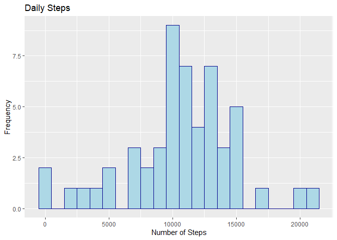
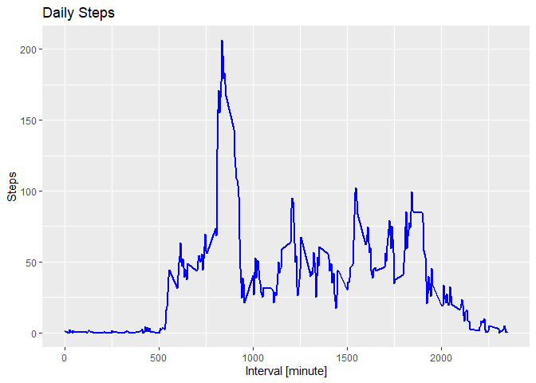
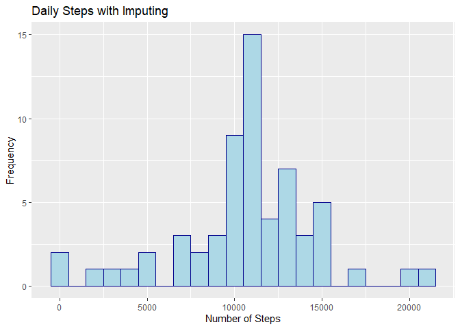
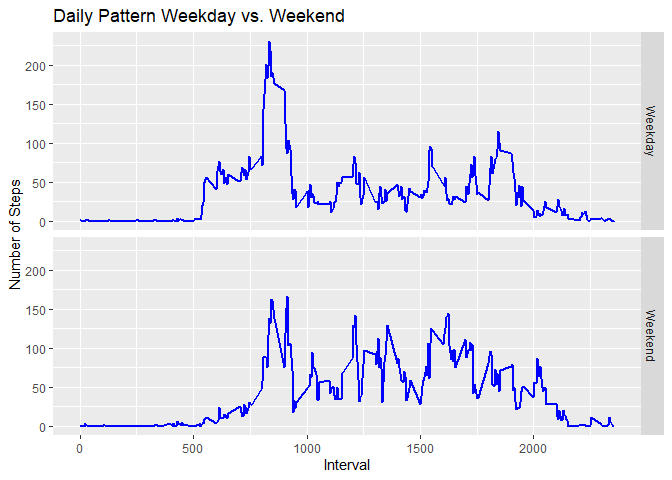

## Loading and preprocessing the data
Load and unzip data with `read.csv()` and `unz()`. Then convert the date column to Date object.

```r
activity <- read.csv(unz('activity.zip','activity.csv'))
activity$date <- as.Date(activity$date)
```


## What is mean total number of steps taken per day?
Group by date and summarize to calculate the number of steps per day. Then calculate the mean and median of the daily steps.

```r
library(dplyr)
```

```
## 
## Attaching package: 'dplyr'
```

```
## The following objects are masked from 'package:stats':
## 
##     filter, lag
```

```
## The following objects are masked from 'package:base':
## 
##     intersect, setdiff, setequal, union
```

```r
daily <- summarize(group_by(activity[!is.na(activity$steps),],date), daily_steps = sum(steps))

daily_mean <- mean(daily$daily_steps)
daily_median <- median(daily$daily_steps)
```

Plot a histogram of the daily steps.

```r
library(ggplot2)
ggplot(daily, aes(x=daily_steps)) + 
        geom_histogram(binwidth=1000,color="darkblue", fill="lightblue") +
        labs(title = "Daily Steps", x = "Number of Steps", y = "Frequency")
```

<!-- -->

The mean of the total number of steps taken per day is 10766.1886792453 and the median of the total number of steps taken per day is 10765.


## What is the average daily activity pattern?
Calculate the mean steps for every 5-minute interval throughtout the time period then plot the daily pattern.

```r
avdaily <- summarize(group_by(activity,interval), mean_steps = mean(steps, na.rm= TRUE))
ggplot(avdaily, aes(x=interval, y=mean_steps)) + 
        geom_line(color="blue", size=1) +
        labs(title = "Daily Steps", x = "Interval [minute]", y = "Steps")
```

<!-- -->

```r
max_interval <- avdaily[avdaily$mean_steps == max(avdaily$mean_steps),]$interval
```

The 5-minute interval, on average across all the days in the dataset, contains the maximum number of steps is 835.

## Imputing missing values


```r
summary(activity)
```

```
##      steps             date               interval     
##  Min.   :  0.00   Min.   :2012-10-01   Min.   :   0.0  
##  1st Qu.:  0.00   1st Qu.:2012-10-16   1st Qu.: 588.8  
##  Median :  0.00   Median :2012-10-31   Median :1177.5  
##  Mean   : 37.38   Mean   :2012-10-31   Mean   :1177.5  
##  3rd Qu.: 12.00   3rd Qu.:2012-11-15   3rd Qu.:1766.2  
##  Max.   :806.00   Max.   :2012-11-30   Max.   :2355.0  
##  NA's   :2304
```

```r
n_incomplete <- sum(!complete.cases(activity))
```
There are 2304 missing values, all of which, according to the above summary, are contained within the steps column.

To impute the missing values we will use the rounded mean across all days for that 5-minute interval.


```r
activity_imp <- activity
for(i in 1:nrow(activity_imp)) {
        if (is.na(activity_imp$steps[i])){
             activity_imp$steps[i] <- round(avdaily[avdaily$interval==activity_imp$interval[i],]$mean_steps)
        }
}
```


Histogram of the total number of steps taken each day, after imputing missing data.


```r
dailyimp <- summarize(group_by(activity_imp,date),daily_steps = sum(steps, na.rm = TRUE))

dailyimp_mean <- mean(dailyimp$daily_steps)
dailyimp_median <- median(dailyimp$daily_steps)
ggplot(dailyimp, aes(x=daily_steps)) + 
        geom_histogram(binwidth=1000, color="darkblue", fill="lightblue") +
        labs(title = "Daily Steps with Imputing", x = "Number of Steps", y = "Frequency")
```

<!-- -->

The mean of the total number of steps taken per day after imputing missing values  is 10765.6393442623 and the median of the total number of steps taken per day is 10762. 


```r
diff_mean <- 100*(daily_mean-dailyimp_mean)/daily_mean
diff_median <- 100*(daily_median-dailyimp_median)/daily_median
```

The imputing has not changed the mean and median significantly. Imputing has decreased the daily mean number of steps by 0.0051024% and the median by 0.0278681%.

## Are there differences in activity patterns between weekdays and weekends?

Create a new factor variable in the dataset with two levels – “weekday” and “weekend” indicating whether a given date is a weekday or weekend day.


```r
activity_imp <- mutate(activity_imp, type = factor(weekdays(date) %in% c('Saturday','Sunday'), labels = c('Weekday', 'Weekend')))
```

Panel plot containing a time series plot (i.e. type = "l") of the 5-minute interval (x-axis) and the average number of steps taken, averaged across all weekday days or weekend days (y-axis).


```r
avdaily_imp <- summarize(group_by(activity_imp,interval,type), mean_steps = mean(steps))
```

```
## `summarise()` has grouped output by 'interval'. You can override using the
## `.groups` argument.
```

```r
ggplot(avdaily_imp, aes(x=interval, y=mean_steps)) + 
        geom_line(color="blue", size=1) +
        labs(title = "Daily Pattern Weekday vs. Weekend", x = "Interval", y = "Number of Steps") +
        facet_grid(type ~.)
```

<!-- -->

The daily patterns between weekend and weekdays differ in many ways. The early day peak at between 800-950 mins is less pronounced on the weekend and there is also less activity before this peak. Throughout the day, activity levels are higher for the weekend then for the weekday and the active period is longer: the number of steps doesn't near zero until 2250 minutes for the weekend but during the weekdays it nears zero closer to 2000 minutes. 
